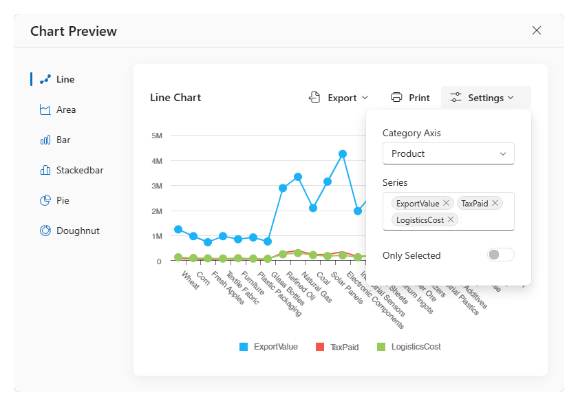
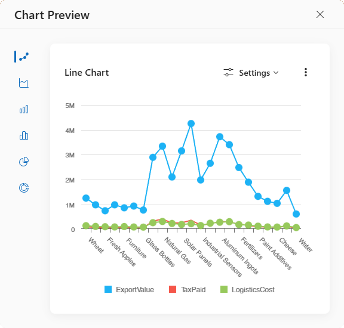

<!-- default badges list -->

<!-- default badges end -->
# DevExtreme DataGrid - Chart Integration

This example demonstrates how to add a Popup with DevExtreme Chart bound to the DataGrid's data. The Chart takes into account the DataGrid filter and selection.
The Popup implements:
- Series Type chooser
- Chart Exporting
- Chart Printing
- Data Settings (Category Axis, Series, Toggle to show all or only selected rows)

Popup adapts to narrow screens:

Use either the DataGrid [toolbar button](https://js.devexpress.com/Documentation/Guide/UI_Components/DataGrid/Getting_Started_with_DataGrid/#Customize_the_Toolbar) or [context menu](https://js.devexpress.com/Documentation/ApiReference/UI_Components/dxDataGrid/Configuration/#onContextMenuPreparing) to invoke the Chart Popup.

## Files to Review

- **Angular**
    - [app.component.html](Angular/src/app/app.component.html)
    - [app.component.ts](Angular/src/app/app.component.ts)
- **React**
    - [App.tsx](React/src/App.tsx)
- **Vue**
    - [App.vue](Vue/src/App.vue)
    - [Home.vue](Vue/src/components/HomeContent.vue)
- **jQuery**
    - [Instructions](jQuery/README.md)
    - [index.html](jQuery/src/index.html)
    - [index.js](jQuery/src/index.js)
    - [chart-integration/chart-api.js](jQuery/src/chart-integration/chart-api.js)
    - [chart-integration/chart-data.js](jQuery/src/chart-integration/chart-data.js)
    - [chart-integration/helpers.js](jQuery/src/chart-integration/helpers.js)
    - [chart-integration/main.js](jQuery/src/chart-integration/main.js)
- **ASP.NET Core**    
    - [Index.cshtml](ASP.NET%20Core/Views/Home/Index.cshtml)

## Documentation

- [Chart Overview](https://js.devexpress.com/Documentation/Guide/UI_Components/Chart/Overview/)
- [PieChart Overview](https://js.devexpress.com/Documentation/Guide/UI_Components/PieChart/Series/Overview/)
- [Popup Overview](https://js.devexpress.com/Documentation/Guide/UI_Components/Popup/Overview/)

<!-- feedback -->
## Does This Example Address Your Development Requirements/Objectives?

 

(you will be redirected to DevExpress.com to submit your response)
<!-- feedback end -->
